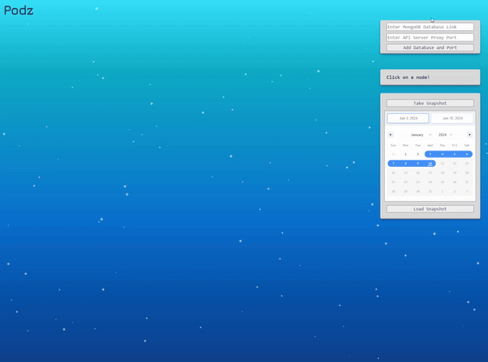

<div align='center'>

[](https://www.javascript.com/)
[](https://www.typescriptlang.org/)
[](https://react.dev/)
[](https://nodejs.org/en)
[](https://expressjs.com/)
[](https://www.docker.com/)
[](https://kubernetes.io/)
[](https://www.mongodb.com/)


[](https://d3js.org/)
[](https://jestjs.io/)

</div>

<p align="center">
Podz is a Kubernetes cluster visualizer for developers to see the metrics of their cluster.<br/>Find out more at <a href="https://www.podz.com/" target="_blank">https://podz.com</a>!
</p>

## Table of Contents

- 🚀 [Features](#features)
- 📒 [Getting Started](#getting-started)
- 🧰 [Examples](#examples)
- 🛠 [Roadmap](#roadmap)
- 🔗 [Contributions](#contributions)
- 🙆 [Founders](#founders)

## Features:

<div align="center">
  
</div>

- Podz, an open-source Kubernetes dev tool, is designed to assist developers in visualizing the architecture of their Kubernetes clusters
- Our web-based GUI enables users of any operating system running a local Kubernetes cluster to effortlessly showcase and visualize their cluster
- With a single click, our platform easily retrieves, stores, and presents comprehensive cluster architecture along with health metrics for each node, pod, container, and service.
- You can view previous metrics with the use of snapshots.
- Included is an example project for users to test and explore Podz, allowing them to try out its features firsthand.

## Getting Started

Download:

- Docker Desktop (https://www.docker.com/products/docker-desktop/)
- kubectl (https://kubernetes.io/docs/tasks/tools/)
- Minikube (https://minikube.sigs.k8s.io/docs/start/).

<strong style="color: red">You must run `npm install`, `npm run build` and have containers set up before continuing on. If you need container examples, go to [examples](#examples).</strong>

While you are following the steps, you may encounter an error mentioning about default not being found. You can run this command to fix it:

> docker context use default

For testing purposes Podz, we highly recommend the usage of Minikube, which uses a minimal local Kubernetes cluster. To use Minikube with Podz, start Minikube with this command:
```js
  minikube start --extra-config apiserver.cors-allowed-origins=["http://*”]
```
What this command does is start up minikube and prevent CORS blocking the connection between the Kubernetes API Server and the Podz website.

After that is done, check if Minikube is created and started up with this command:
```js
  kubectl get all
```
Next, you need to load the images into Minikube. To do that, run this command:
```js
  minikube image load &lt;projects:version&gt;
```
`projects` needs to be replaced by the name of the image and `version` needs to be the tag of the image. Check Docker Desktop to find the image name and tags.

Now, you need to apply all `.yaml` files to kubectl by running this command:
```js
  kubectl apply -f &lt;.yml file name&gt;
```
Lastly, we need to start up the proxy server so we can fetch for metrics of your cluster. Run the command:
```js
  kubectl proxy --port=&lt;number&gt;
```
This can be any port of your choice, so long as you change the Podz website’s port to match it.

## Examples

In the `test-project` folder, you can use those project examples to store in your containers. Next, `cd` to the test project folder and run the command:
```js
  docker-compose build
```
Now, you have 3 containers set up and you should be able to see 3 images in your Docker desktop!

## Roadmap

- Fully converting to TypeScript
- Testings for frontend
- Loading clusters in the correct position like a binary search tree
- Notification alerts
- Live reloading of cluster
- More metrics like CPU, memory, etc.
- Visualizer for Docker containers

## Contributions

The open-source community is awesome because of contributors like you. Your contributions are invaluable!

If you have a suggestion, fork the repo and make a pull request. You can also open an issue to discuss your idea. And, don't forget to give the project a star! Thanks!

1. Fork the Project
2. Create your Feature Branch (`git checkout -b feature/AmazingFeature`)
3. Commit your Changes (`git commit -m 'Add some AmazingFeature'`)
4. Push to the Branch (`git push origin feature/AmazingFeature`)
5. Open a Pull Request

## Founders

- Bin Zheng [Github](https://github.com/binzheng622) | [LinkedIn](https://www.linkedin.com/in/bin-zheng-b912532a/)
- Ezekiel Mohr [Github](https://github.com/Ezmr7) | [LinkedIn]()
- Jeffrey Mai [Github](https://github.com/jeffrey-mai) | [LinkedIn](https://www.linkedin.com/in/jeffrey-mai-fiv/)
- Philip Wang [Github](https://github.com/pwang10) | [LinkedIn](https://www.linkedin.com/in/philipwang1/)
